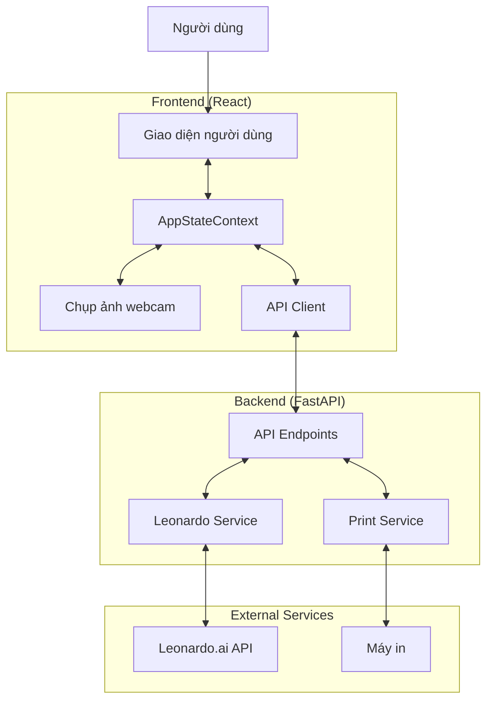
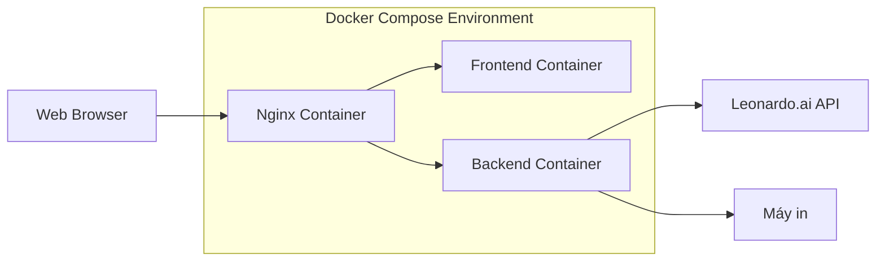
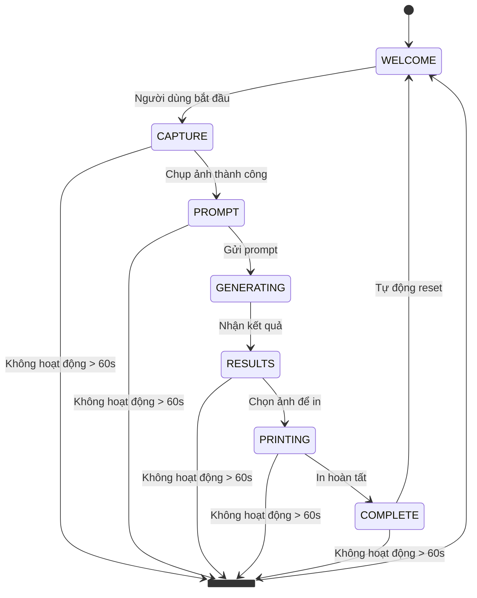
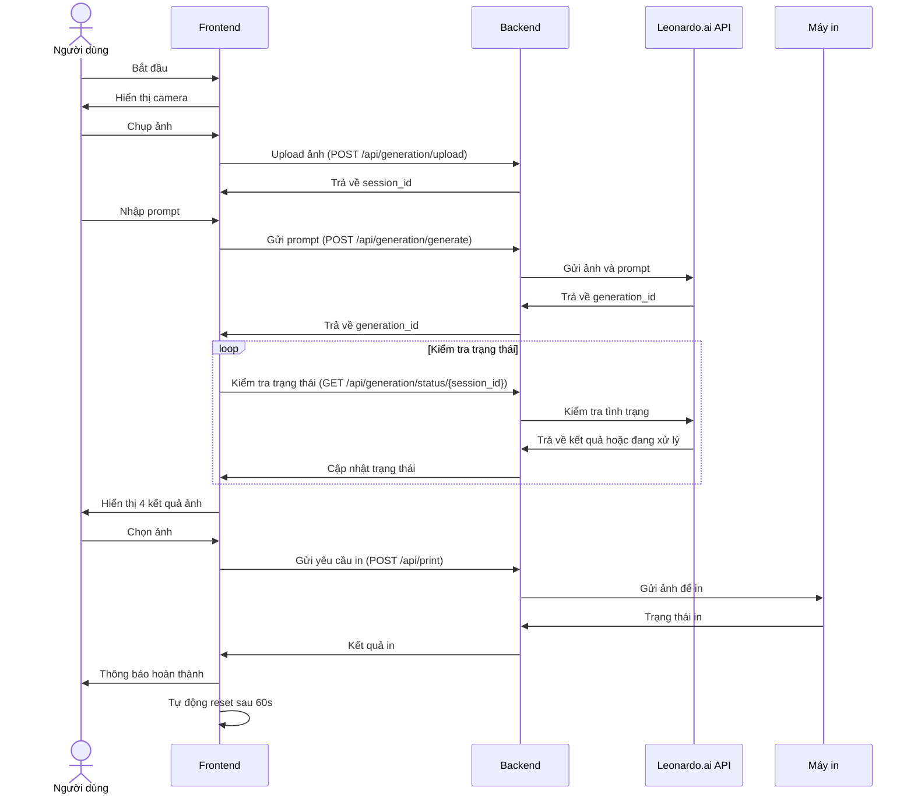

# System Patterns - AI Photo Booth

## Kiến trúc tổng quan

## Mô hình triển khai

## Quản lý trạng thái

### Máy trạng thái ứng dụng

### Quản lý trạng thái Frontend

- Sử dụng **React Context API** (`AppStateContext.js`) để quản lý trạng thái toàn cục
- Các actions được định nghĩa rõ ràng để xử lý chuyển trạng thái
- Tự động theo dõi thời gian không hoạt động để reset ứng dụng

### Luồng xử lý dữ liệu

## Các mẫu thiết kế chính

### 1. State Management Pattern
- Sử dụng React Context API để quản lý trạng thái ứng dụng toàn cục
- Reducer pattern để xử lý các hành động thay đổi trạng thái
- Tách biệt rõ ràng giữa UI và logic trạng thái

### 2. Service Pattern
- Backend sử dụng các service objects để gói gọn logic tương tác với các API bên ngoài
- `LeonardoService`: Xử lý giao tiếp với Leonardo.ai API
- `PrintService`: Xử lý tương tác với máy in

### 3. Session-based Processing
- Mỗi phiên sử dụng có một session_id duy nhất
- Các file tạm thời và kết quả được lưu trong thư mục phiên
- Cơ chế tự động dọn dẹp sau khi hoàn thành

### 4. Async Status Polling
- Sử dụng polling để kiểm tra trạng thái xử lý ảnh không đồng bộ từ Leonardo.ai
- Backend cung cấp endpoint để kiểm tra trạng thái

### 5. Microservice Architecture
- Sử dụng Docker và Docker Compose để triển khai các service riêng biệt
- Nginx làm reverse proxy cho frontend và backend
- Các container giao tiếp qua mạng nội bộ

## Các thành phần chính

### Frontend
- **WelcomeScreen**: Màn hình chào mừng, khởi đầu ứng dụng
- **CameraCapture**: Chụp ảnh từ webcam
- **PromptInput**: Nhập mô tả phong cách
- **GeneratingScreen**: Hiển thị trong quá trình tạo ảnh
- **ResultScreen**: Hiển thị và cho phép chọn kết quả
- **PrintingScreen**: Hiển thị trong quá trình in
- **CompleteScreen**: Thông báo hoàn thành

### Backend
- **GenerationRouter**: Xử lý các endpoint liên quan đến việc sinh ảnh
  - `/upload`: Upload ảnh ban đầu
  - `/generate`: Gửi yêu cầu sinh ảnh đến Leonardo
  - `/status/{session_id}`: Kiểm tra trạng thái xử lý
  - `/session/{session_id}`: Dọn dẹp dữ liệu phiên
- **PrintRouter**: Xử lý yêu cầu in ảnh
- **LeonardoService**: Tương tác với Leonardo.ai API
- **PrintService**: Tương tác với máy in
